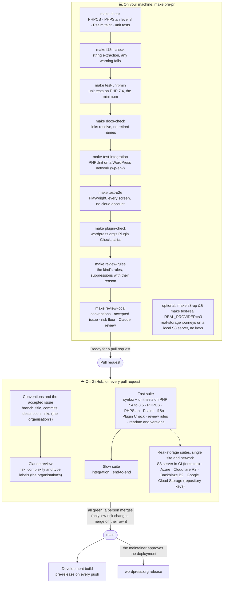

# DiluxOne Offload

**Your WordPress media library, on Azure Blob Storage or any S3-compatible storage, without changing a single URL in your content.**

[](LICENSE) [](https://wordpress.org/plugins/diluxone-offload/) [](https://diluxone.com)

A free WordPress plugin by [**Pablo Di Loreto**](https://diluxone.com). This page is the map of the repository: what the plugin does, where to get it, and how to work on it, as a person or through an AI coding agent. Every section links to the document with the details.

- [What it does](#what-it-does)
- [Get the plugin](#get-the-plugin)
- [Contribute](#contribute)
- [How a change is made: people and agents follow the same steps](#how-a-change-is-made-people-and-agents-follow-the-same-steps)
- [What runs on your machine and what runs on GitHub](#what-runs-on-your-machine-and-what-runs-on-github)
- [People stay in charge](#people-stay-in-charge)
- [Every document, by question](#every-document-by-question)

## What it does

DiluxOne Offload moves `/wp-content/uploads/` to Azure Blob Storage, Amazon S3, Cloudflare R2, Backblaze B2, Google Cloud Storage, DigitalOcean Spaces, Wasabi, Hetzner, Akamai (Linode), Vultr, Scaleway, OVHcloud, IDrive e2 or any server that speaks the S3 API, and serves it from there. It works through a PHP stream wrapper, so your posts, your database and your other plugins keep working as they are. Free, complete, on your own account and keys.

It is for:

- Sites on **App Service, containers or any host with a small or ephemeral disk**.
- **Multisite networks** that share one storage account or bucket, each site in its own folder.
- **WooCommerce and page-builder sites** that cannot afford URL rewriting.
- Anyone who wants the uploads off the web server, on storage they already pay for.

| Service | How you set it up | Tested against the real service on every change |
|---|---|---|
| **Azure Blob Storage** | storage account, container, key | ✅ |
| **Cloudflare R2** | preset: account endpoint and the bucket's public URL | ✅ |
| **Google Cloud Storage** (HMAC keys) | preset | ✅ |
| **Backblaze B2** | preset | ✅ |
| **Amazon S3**, **DigitalOcean Spaces**, **Wasabi**, **Hetzner**, **Akamai (Linode)**, **Vultr**, **Scaleway**, **OVHcloud** | presets: region and bucket fill in the rest | not yet |
| **IDrive e2** | preset: region fills in the endpoint; the bucket's public URL is typed | not yet |
| **Anything else that speaks S3**: MinIO, Ceph, Oracle Cloud, … | *Custom*: endpoint, region and public URL; path-style or virtual-hosted | an S3 server (RustFS) started in CI, on every pull request |

The **Public URL** is its own field, so a CDN or a custom domain goes right there. **Test Connection** writes a small probe, reads it back without credentials and deletes it: a bucket browsers cannot read is refused before anything is saved.

What it does today, what comes next and what it will not do: [`docs/roadmap.md`](docs/roadmap.md). How it is built: [`docs/architecture.md`](docs/architecture.md).

## Get the plugin

The plugin is distributed through **wordpress.org**: **[wordpress.org/plugins/diluxone-offload](https://wordpress.org/plugins/diluxone-offload/)**. Do not install it from this repository: the repository holds the source, the tests and the tooling, and the release pipeline builds the plugin from it.

1. In WordPress: **Plugins → Add New**, search for *DiluxOne Offload*, install and activate (or download the zip from the link above).
2. **DiluxOne Offload → Cloud Provider**: pick the service, enter the bucket or container and the keys, **Test Connection**, save.
3. **Sync & Offloading**: start the sync, and turn offloading on when it finishes.

Requirements, FAQ, known limitations and the changelog are in [`readme.txt`](readme.txt), the page wordpress.org shows. Questions about using it go to the [support forum](https://wordpress.org/support/plugin/diluxone-offload/), where the answer stays public for the next person.

Want what is coming before it is released? The [**Development build**](https://github.com/DiluxOne/diluxone-offload-wordpress/releases/tag/dev) is the current `main`, rebuilt on every change. Not for production sites.

### Coming: a hosted sync service (work in progress)

A paid service is being built to sync your files to the cloud for you, from outside your server: <https://diluxone.com/plugins-wordpress/dilux-offload/>. It is not available yet. The plugin stays free and complete without it: nothing in the plugin is unlocked by it, and the plugin never contacts it until a later version ([5.0.0](docs/roadmap.md#500-diluxone-storage)) offers it as one more provider to choose. What stays free and what will be paid: [`docs/roadmap.md`](docs/roadmap.md#paid-outside-the-plugin).

## Contribute

| You want to | Do this |
| --- | --- |
| Report a bug or ask for a feature | [Open an issue](https://github.com/DiluxOne/diluxone-offload-wordpress/issues/new/choose) with its form. Claude labels it and replies once; a person decides what happens next, and accepts it (the `accepted` label) when it is to be done ([`CONTRIBUTING.md`](CONTRIBUTING.md#questions-bugs-and-ideas)). |
| Report a vulnerability | Privately, as the organisation's [security policy](https://github.com/DiluxOne/.github/blob/main/SECURITY.md) explains. Never in a public issue. |
| Change the code or the docs | **Fork** the repository (or branch it, if you are a maintainer), clone it and follow the steps below. Pull requests are welcome. |

## How a change is made: people and agents follow the same steps

This project is **AI-first**: it is built with AI coding agents under human review, and it is set up so that yours can work on it too. With an agent (Claude Code, Codex, Cursor, …), clone the repository and tell it: **"read [`AGENTS.md`](AGENTS.md) and follow it"**. It walks the agent through the whole process. Without one, you follow **the same steps**; the organisation's [contributing guide](https://github.com/DiluxOne/.github/blob/main/CONTRIBUTING.md) and [`CONTRIBUTING.md`](CONTRIBUTING.md) say them for people. Either way, what is checked is the same, and nothing depends on which one of you typed the code.

```bash
git clone https://github.com/<you>/diluxone-offload-wordpress.git   # your fork
cd diluxone-offload-wordpress
make install        # the dev tools into vendor/ (Docker, Node.js, make and git; no PHP on your machine)
make env            # WordPress at http://localhost:8888, admin / password, with the plugin mounted
make env-multisite  # the tests site as a network, for the multisite tests
```

1. **Start from an accepted issue**, and branch from `main` as `<type>/<number>-<kebab-case>`, for example `fix/61-sync-retry-count` (`dx start <number>`, from [DiluxOne/.github](https://github.com/DiluxOne/.github/blob/main/docs/agents.md)).
2. **Make the change with its tests at every layer it touches** (unit, integration, end-to-end, the real-storage suites when storage behaviour changes, the screenshots when a screen changes), the docs that describe it, and a changelog line when a user will notice it ([`docs/testing-and-quality.md`](docs/testing-and-quality.md)).
3. **Commit** with [Conventional Commit](https://www.conventionalcommits.org/) headers of 72 characters or fewer.
4. **Write the pull request description** in `build/pr.md`, with the sections of the organisation's [template](https://github.com/DiluxOne/.github/blob/main/pull_request_template.md) and `Closes #<number>`.
5. **Run everything the pull request will be checked on, here, first:**
   ```bash
   make pre-pr REVIEW_ARGS="--title 'fix(sync): what it does' --body-file build/pr.md"
   ```
6. **Fix what it finds.** The local review writes each finding, with its file and line, to `.git/dx-review/findings.md`. Fix, commit, run step 5 again (it reviews only what changed) until it says **Ready for a pull request**.
7. **Open the pull request.** The same checks and the same review run again on GitHub, plus the few that need the cloud's keys. Every push to an open pull request is another paid review and another wait, so it opens clean and is reviewed once.

`make help` lists every other target; [`docs/development.md`](docs/development.md) explains the setup, including why the repository name (`diluxone-offload-wordpress`) is not the plugin slug (`diluxone-offload`).

## What runs on your machine and what runs on GitHub

Almost everything a pull request is checked on runs on your machine with `make pre-pr`, including the AI review, on your own Claude account. Only what needs the cloud's keys or a matrix of PHP versions stays on GitHub.



| Check | On your machine | On GitHub |
| --- | --- | --- |
| Conventions: branch, title, commits, description, accepted issue | `make review-local` | ✅ |
| PHPCS, PHPStan level 8, Psalm taint, unit tests | `make check` | ✅ |
| Unit tests on PHP 7.4 | `make test-unit-min` | ✅ |
| Unit tests on PHP 8.0 to 8.5 | no | ✅ |
| Docs: links and retired names | `make docs-check` | ✅ |
| i18n extraction, any warning fails | `make i18n-check` | ✅ |
| Integration tests (WordPress + MySQL, multisite) | `make test-integration` | ✅ |
| End-to-end tests (every screen, no cloud account) | `make test-e2e` | ✅ |
| wordpress.org Plugin Check, strict | `make plugin-check` | ✅ |
| The kind's review rules (suppressions with their reason) | `make review-rules` | ✅ |
| The Claude review | `make review-local`, on your Claude account | ✅ on the organisation's account; not on forks |
| Real-storage journeys against an S3 server | `make s3-up && make test-real REAL_PROVIDER=s3` | ✅, forks included |
| Real-storage journeys against Azure, R2, B2, Google | only with keys (maintainers) | ✅ with the repository's keys; on forks, after the merge |
| Listing screenshots | `make screenshots`, when a screen changes | no |
| CodeQL (JavaScript) | no | ✅ when JavaScript changes |

What each gate catches and how to run it alone: [`docs/testing-and-quality.md`](docs/testing-and-quality.md). What CI cannot run on a fork, and why: [`CONTRIBUTING.md`](CONTRIBUTING.md#forks-and-the-real-storage-suites).

## People stay in charge

The agents write, test and review; people decide. The maintainer reads every diff and signs every commit. A person merges everything that is not low risk. Only the maintainer approves a release; the version is computed from what merged, never typed. The review rules change only through a pull request a person approves. And whoever opens a pull request owns its code, whatever tool wrote it. The rules for contributing with AI, and what is never automated: [`docs/ai.md`](docs/ai.md).

## Every document, by question

| Question | Read |
| --- | --- |
| **I am an AI agent, or I work with one: what do I do?** | [`AGENTS.md`](AGENTS.md) |
| How do I contribute: issues, branches, pull requests, what CI enforces | The organisation's [contributing guide](https://github.com/DiluxOne/.github/blob/main/CONTRIBUTING.md) |
| What is specific to this plugin: forks and the real-storage suites, code rules | [`CONTRIBUTING.md`](CONTRIBUTING.md) |
| How is AI used here, and what are the rules for AI-assisted work | [`docs/ai.md`](docs/ai.md) |
| How do I report a vulnerability | The organisation's [security policy](https://github.com/DiluxOne/.github/blob/main/SECURITY.md) |
| How do I set up my machine, which Make targets exist | [`docs/development.md`](docs/development.md) |
| What does each quality gate check, and when does it run | [`docs/testing-and-quality.md`](docs/testing-and-quality.md) |
| How is the plugin built, which rules must its code follow | [`docs/architecture.md`](docs/architecture.md) |
| What does it do, what comes next, what will it never do | [`docs/roadmap.md`](docs/roadmap.md) |
| What exactly is being built for the next version | [`docs/plans/`](docs/plans/) |
| How does a change become a version and reach wordpress.org | [`docs/release.md`](docs/release.md) |
| What users see: requirements, FAQ, changelog | [`readme.txt`](readme.txt) |
| The organisation's shared workflows, review profiles and code of conduct | [DiluxOne/.github](https://github.com/DiluxOne/.github) |

## About

Written and maintained by [Pablo Di Loreto](https://diluxone.com) ([@soydiloreto](https://github.com/soydiloreto)). Free software under the GPL-2.0-or-later, see [LICENSE](LICENSE). Issues, forks and pull requests are welcome.
